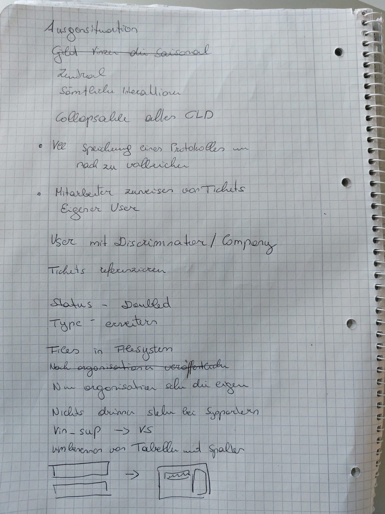

= Vicosu
Anna Hartl, Sheila Hautzmayer
1.3
:sourcedir: ../src/main/java
:icons: font
:toc: left

:sectnums!:
== Protocol

:sectnums!:
=== 2021-11-23

[%autowidth, cols=2*]
|===

|Participants
|Sheila Hautzmayer, Anna Hartl, Julian Hautzmayer

|From-To
|SYP-Unterricht

|Duration
|150 minutes
|===

==== Summary
* Created GitLab repositories
* Worked on backend (DTOs, Repos, Services, Entities for User and Report)

=== 2021-11-28

[%autowidth, cols=2*]
|===

|Participants
|Sheila Hautzmayer, Anna Hartl

|From-To
|13:00 - 15:30

|Duration
|150 minutes
|===

==== Summary
* Worked on documentation and landing page

=== 2021-12-06

[%autowidth, cols=2*]
|===

|Participants
|Sheila Hautzmayer, Anna Hartl

|From-To
|09:15 - 10:50

|Duration
|95 minutes
|===

==== Summary
* Worked on tests for User and UserService
* Worked on tests for Report and ReportService

=== 2021-12-07

[%autowidth, cols=2*]
|===

|Participants
|Sheila Hautzmayer, Anna Hartl, Bernhart Reinsprecht, Matthias Böhm, Julian Dummy

|From-To
|14:40 - 17:15

|Duration
|150 minutes
|===

==== Summary
* Planned first sprint
* Set up angular frontend

=== 2021-12-13

[%autowidth, cols=2*]
|===

|Participants
|Sheila Hautzmayer, Anna Hartl

|From-To
|10:00 - 10:50

|Duration
|50 minutes
|===

==== Summary
* Angular first steps

=== 2021-12-14

[%autowidth, cols=2*]
|===

|Participants
|Sheila Hautzmayer, Anna Hartl

|From-To
|15:30 - 17:10

|Duration
|100 minutes
|===

==== Summary
* Angular first steps finished (https://angular.io/tutorial)
* Displayed lists in Angular

=== 2021-12-21

[%autowidth, cols=2*]
|===
|Participants
|Sheila Hautzmayer, Anna Hartl

|From-To
|14:40 - 17:00

|Duration
|140 minutes
|===

==== Summary
* Server: ReportController fixed endpoint for inserting a new report
* Server: Enum values changed to capital letters
* Web: Displayed users in Angular from server

=== 2022-01-23

[%autowidth, cols=2*]
|===
|Participants
|Sheila Hautzmayer, Anna Hartl

|From-To
|14:00 - 16:00

|Duration
|120 minutes
|===

==== Summary
* Server: Added tests for report
* Server: Added tests for users
* Server: Made tests run in spring
* Web: Displayed reports in Angular from server
* Web: Programmed buttons for deleting, updating, adding and searching reports

=== 2022-01-23

[%autowidth, cols=2*]
|===
|Participants
|Thomas Stütz, Sheila Hautzmayer, Anna Hartl

|From-To
|09:30 - 10:50

|Duration
|80 minutes
|===

==== Summary
* Feedback on system specification
* Rename entity "Report" and project name "Support Platform"

=== 2022-01-25

[%autowidth, cols=2*]
|===
|Participants
|Julian Hautzmayer, Matthias Böhm, Sheila Hautzmayer, Anna Hartl

|From-To
|14:50 - 16:50

|Duration
|120 minutes
|===

==== Summary
* Discussion about next steps
* End of sprint 1 with feedback
* Sprint 2 planned

=== 2022-02-01

[%autowidth, cols=2*]
|===
|Participants
|Sheila Hautzmayer, Anna Hartl

|From-To
|14:50 - 17:00

|Duration
|130 minutes
|===

==== Summary
* Sprint 2 planned
* Worked on feedback from merge request

=== 2022-03-01

[%autowidth, cols=2*]
|===
|Participants
|Sheila Hautzmayer, Anna Hartl

|From-To
|14:50 - 17:00

|Duration
|130 minutes
|===

==== Summary
* Sprint 2 finished
* Created merge requests for sprint 2
* Sprint 3 planned (Announcement, Comment, small frontend changes)
* Commit messages with comment of child branches (Only parent branches necessary)

=== 2022-03-08

[%autowidth, cols=2*]
|===
|Participants
|Sheila Hautzmayer, Anna Hartl, Julian Hautzmayer, Thomas Stütz, Michael Bucek

|From-To
|14:50 - 17:00

|Duration
|130 minutes
|===

==== Summary
* Discussed the project and what we have done

=== 2022-03-21

[%autowidth, cols=2*]
|===
|Participants
|Sheila Hautzmayer, Anna Hartl, Matthias Böhm, Julian Hautzmayer

|From-To
|9:00 - 9:50

|Duration
|130 minutes
|===

==== Summary
* Frontend should be formatted in the same way as Vinitor
** List view for tickets
** Detailed view for every ticket
** Sidebar needs to be formatted
** Colorful dots next to each ticket based on the state
** Filtering and searching tickets
* Distinction between user and admin needs to be implemented
* Later: Send emails when a new ticket is created
* Later: Admin publishes tickets which are approved by him

=== 2022-03-21

[%autowidth, cols=2*]
|===
|Participants
|Sheila Hautzmayer, Anna Hartl, Thomas W. Stütz

|From-To
|14:50 - 15:00

|Duration
|10 minutes
|===

==== Summary

* Welche Daten brauchen wir genau von Vinitor -> User

* Schnittstelle, also wie bekomme ich den User
* Link zu uns

* Werbeseite steht groß da (also announcements fragen wie viel Sinn es ergibt)

* Tickets dann halt

* Sie sollen das in html ändern (statische Seite)?

* Static Website generator(zb Hugo) -> nur auschecken, statische Websiten ändern, seite aktualisiert und wieder einchecken

=== 2022-04-05

[%autowidth, cols=2*]
|===
|Participants
|Sheila Hautzmayer, Anna Hartl, Matthias Böhm

|From-To
|15:00 - 15:30

|Duration
|30 minutes
|===

==== Summary

* Projekt darf zu Vicosu benannt werden

* Sidebar wie bei Vinitor sollte gemacht werden

* Statische Websiten -> werden nicht gebraucht, so stellt es sich Vinitor nicht vor, wie CMS mit Datenbankanbindung

* Mit Julian Termin für Login ausmachen
