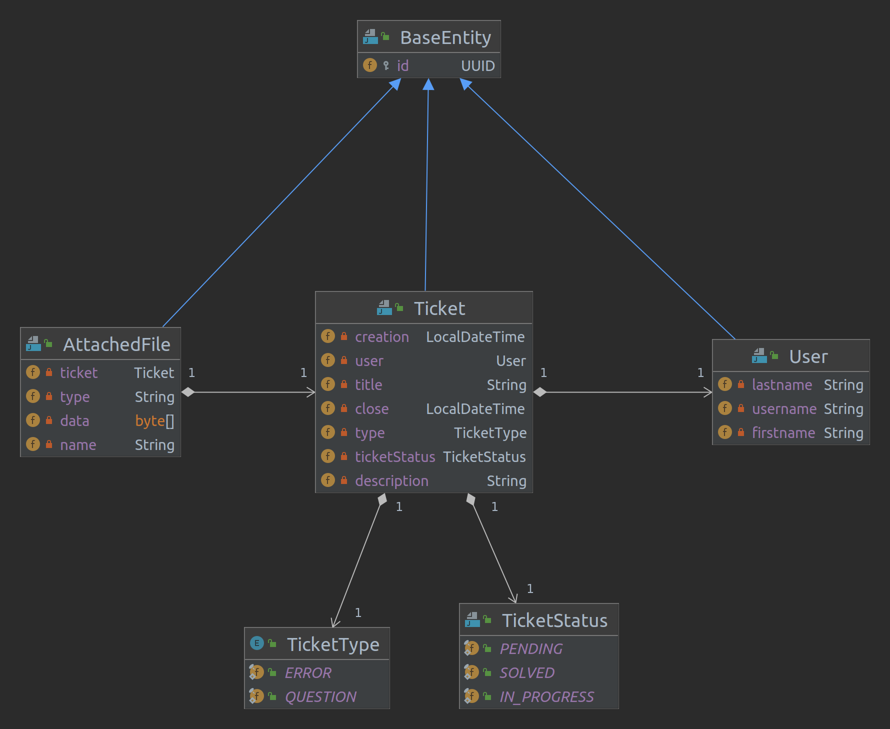

= Vinitor - Support Platform
Anna Hartl, Sheila Hautzmayer
1.0
:sourcedir: ../src/main/java
:icons: font
:toc: left
:sectnums:

== System Specification

=== Business Analyses
When customers have a problem with Vinitor they have to call or send an email to the owners.
Owners inform their customers about news by sending out emails.

=== Market Research

include::https://otobo.de/de/open-source-ticketsystem/[Link1]

include::https://www.googleadservices.com/pagead/aclk?sa=L&ai=DChcSEwiX_JfMue71AhUIjWgJHfR0AtwYABACGgJ3Zg&ohost=www.google.com&cid=CAESWOD2HanqdleCFP5R-khAdFjZU2R00sOJfevXuB0yPAKHpwWNBRoqEI6MV3baaEGDxtHezdMtYL_jP5C-OnDFpolZQ_a0hOXdx75UDBgUHYHHdcEHNA59uO0&sig=AOD64_1h683rwgOkvxRf8UFTwOVFYhmjaQ&q&adurl&ved=2ahUKEwiCxozMue71AhXGS_EDHUD3BMwQ0Qx6BAgEEAE[Link2]

include::https://freshdesk.com/de/lp/kostenloses-ticketsystem/?tactic_id=3387461&utm_source=Google-AdWords&utm_medium=FD-ResellerEU-EU2-L-Search-Germany-Ticketing&utm_campaign=FD-ResellerEU-EU2-L-Search-Germany-Ticketing&utm_term=open%20source%20support%20ticket%20system&device=c&gclid=CjwKCAiAo4OQBhBBEiwA5KWu_wfJjGpnhYESaEIUAoVYcZbGbYH9gnqDtLmN4YxtATsIv58tJVxHbBoCdo8QAvD_BwE[Link3]

Vinitor wants to help their customers and show them how to use the software.
To support them they want their self programmed website which

* Helps users by answering user tickets
* Acts as a social media system
* Offers the users video material

=== CLD 01

[plantuml,align=left]
----
include::plantuml/cld_vinitor.puml[]
----

=== CLD 02

[plantuml,align=left]
----
include::plantuml/cld_vinitor_02.puml[]
----

=== Current State Of ERD

=== Problem Definition
The owners can not spread news and information to all their customers in an easy way. Emails can get lost and overseen by customers.
Customers can not interact with each other. When a problem occurs often it has to be explained countless times.
The owners are overwhelmed with the calls and emails.

=== Use-case-diagram
[plantuml,align=left]
----
include::plantuml/use_case_customer.puml[]
----
[plantuml,align=left]
----
include::plantuml/use_case_owner.puml[]
----

=== Use-cases (Functional Requirements)
* Users can log in/log out of the application
* Users can report bugs
* Users can upvote reported bugs
* Owners can comment on the reported bugs
* Owner has statics over bugs
* Users can send direct messages to the owners (vise versa)
* Owners can post announcements (Can be liked, disliked and commented by users)
* Announcements can have dates -> calendar
* Owners can post learning material like blog posts and video tutorials (Users can watch them)
* Owners can make a survey/vote (Users can vote)
* Announcements can be connected with email and social media

=== Non Functional Requirements
* Security
* Usability
* Accessibility
* Stability
* Coexistence

=== Goal
The support platform should help with the cooperation and collaboration of customers and owners by simplifying the communication.

=== Framework
IDE: Intellij

Programming Languages: Angular (Front end), Java (Back end)

Database language: MariaDB (open source SQL)

VCS: Git (GitLab)

Organization: Jira

=== Acceptance criteria
Every use case needs to be fulfilled. The platform needs to run smoothly for every customer.

